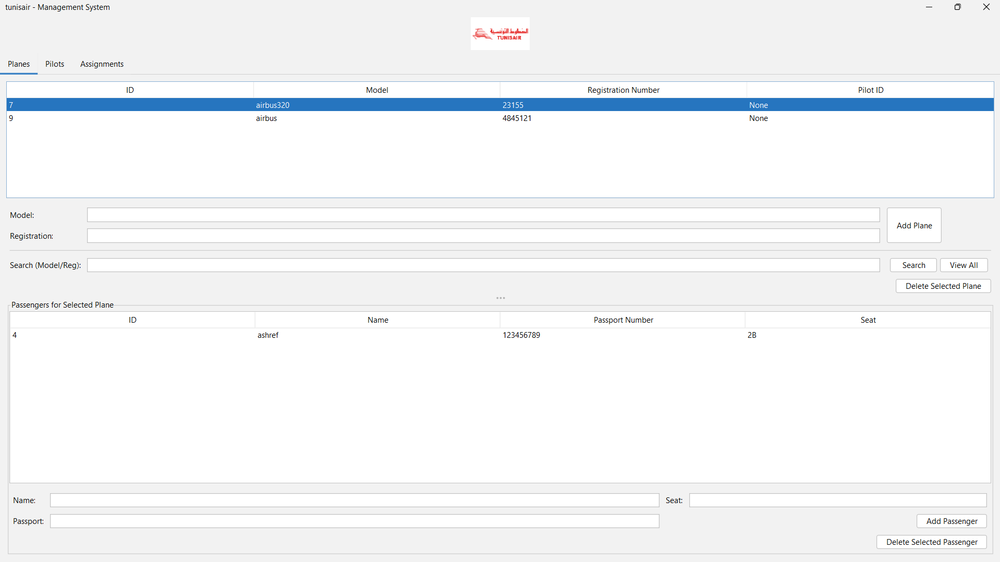
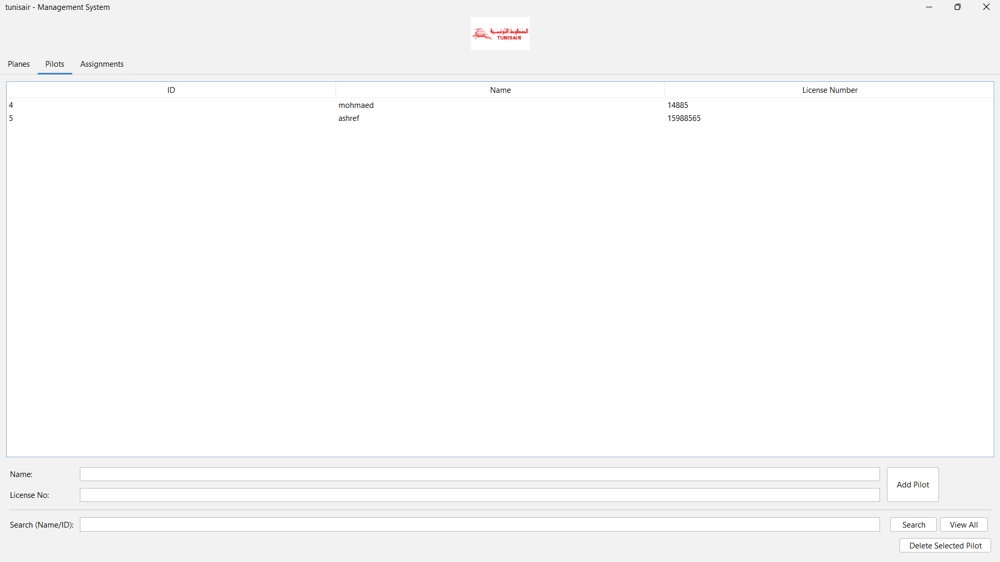
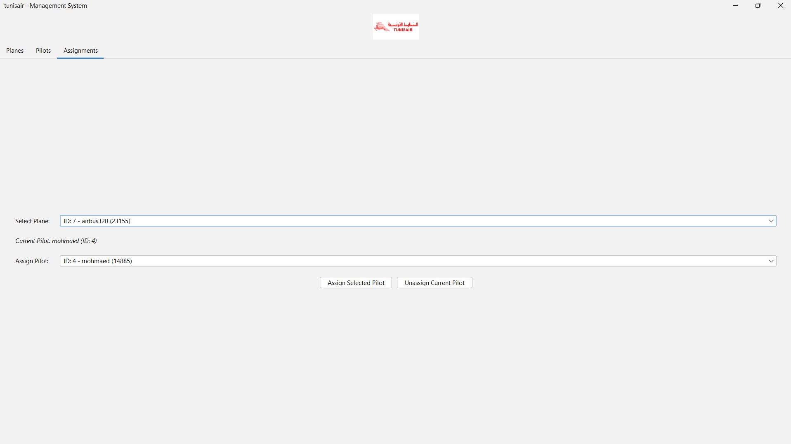

# Plane & Pilot Management System

A simple Java Swing desktop application to manage airplanes, pilots, passengers, and their assignments, using a PostgreSQL database for persistence.

## Features

*   **Plane Management:** Add, view, search (by model/registration), and delete planes.
*   **Pilot Management:** Add, view, search (by name/ID), and delete pilots.
*   **Passenger Management:** Add and delete passengers for a selected plane.
*   **Assignments:** Assign pilots to planes and view current assignments.
*   **Database Persistence:** All data is stored in a PostgreSQL database.
*   **Basic GUI:** Uses Java Swing for the user interface with a tabbed layout.
*   **DAO Pattern:** Data access logic is separated using the Data Access Object pattern.

## Technologies Used

*   Java
*   Java Swing (for GUI)
*   JDBC (for database connectivity)
*   PostgreSQL (Database)
*   Neon (Database Hosting Provider - based on connection string)
*   FlatLaf (for modern Look and Feel)

## Setup

### 1. Database Setup

*   Ensure you have a PostgreSQL database accessible. The connection details are currently configured for a Neon database.
*   Connect to your database and execute the following SQL commands to create the necessary tables:

    ```sql
    -- Table for Pilots
    CREATE TABLE pilots (
        id SERIAL PRIMARY KEY,
        name VARCHAR(255) NOT NULL,
        license_number VARCHAR(100) UNIQUE NOT NULL
    );

    -- Table for Planes
    CREATE TABLE planes (
        id SERIAL PRIMARY KEY,
        model VARCHAR(100) NOT NULL,
        registration_number VARCHAR(100) UNIQUE NOT NULL,
        pilot_id INTEGER NULL,
        FOREIGN KEY (pilot_id) REFERENCES pilots(id) ON DELETE SET NULL -- If a pilot is deleted, set pilot_id to NULL
    );

    -- Table for Passengers
    CREATE TABLE passengers (
        id SERIAL PRIMARY KEY,
        name VARCHAR(255) NOT NULL,
        passport_number VARCHAR(100) NOT NULL,
        seat_number VARCHAR(10) NOT NULL,
        plane_id INTEGER NOT NULL,
        CONSTRAINT fk_plane
            FOREIGN KEY(plane_id)
            REFERENCES planes(id)
            ON DELETE CASCADE, -- If a plane is deleted, its passengers are also deleted
        CONSTRAINT unique_seat_per_plane UNIQUE (plane_id, seat_number) -- Ensure seat numbers are unique within each plane
    );

    -- Optional: Add an index for faster passenger lookups by plane_id
    CREATE INDEX idx_passenger_plane_id ON passengers(plane_id);
    ```

### 2. Database Connection Configuration

*   The database connection URL, username, and password are currently configured in `src/main/java/com/planeapp/util/DatabaseConnection.java`.
*   **Important:** For security, avoid hardcoding credentials directly in the source code in production environments. Consider using environment variables or external configuration files.

### 3. PostgreSQL JDBC Driver

*   This project requires the PostgreSQL JDBC driver JAR file.
*   **Download:** Get it from the [official PostgreSQL JDBC Driver download page](https://jdbc.postgresql.org/download/).
*   **Add to Classpath:** You need to add the downloaded `.jar` file to your Java project's classpath.
    *   **If using an IDE (like VS Code/Cursor, IntelliJ, Eclipse):** Add the JAR as a referenced library or external JAR in your project's build path settings.
    *   **If using command line:** Include the JAR using the `-cp` or `-classpath` flag when compiling and running.

### 4. FlatLaf Look and Feel Library (Optional, for Modern UI)

*   This project uses the [FlatLaf](https://www.formdev.com/flatlaf/) library to provide a modern look and feel (specifically `FlatLightLaf`).
*   If you want to use this theme, you need to download the FlatLaf JAR file.
*   **Download:** You can usually find the latest JAR on the [FlatLaf GitHub Releases page](https://github.com/JFormDesigner/flatlaf/releases) or via Maven Central.
*   **Add to Classpath:** Similar to the JDBC driver, add the downloaded `flatlaf-x.x.x.jar` file to your Java project's classpath.
    *   **If using an IDE:** Add the JAR as a referenced library.
    *   **If using command line:** Include the JAR in the `-cp` flag.
        *Example (Compile): `javac -cp ".;path/to/postgresql.jar;path/to/flatlaf.jar" ...`*
        *Example (Run): `java -cp ".;path/to/postgresql.jar;path/to/flatlaf.jar" com.planeapp.gui.PlaneAppGUI`*
    *   If FlatLaf is not found in the classpath, the application will fall back to the system's default look and feel.

## Running the Application

1.  Make sure you have completed the Database Setup and added the required JDBC Driver (and optionally the FlatLaf JAR).
2.  Compile all `.java` files.
3.  Run the main class: `com.planeapp.gui.PlaneAppGUI`.

    Example (Command Line - adjust paths):
    ```bash
    # Compile (assuming src is in current dir)
    # Example includes FlatLaf JAR
    javac -cp ".;path/to/postgresql-XX.X.X.jar;path/to/flatlaf-X.X.X.jar" src/main/java/com/planeapp/util/*.java src/main/java/com/planeapp/model/*.java src/main/java/com/planeapp/dao/*.java src/main/java/com/planeapp/gui/*.java

    # Run
    # Example includes FlatLaf JAR
    java -cp ".;path/to/postgresql-XX.X.X.jar;path/to/flatlaf-X.X.X.jar" com.planeapp.gui.PlaneAppGUI
    ```

    *Replace `path/to/postgresql-XX.X.X.jar` and `path/to/flatlaf-X.X.X.jar` with the actual paths.*
    *If using an IDE, you can typically just right-click `PlaneAppGUI.java` and select "Run".*

## Screenshots

**Main Window (Planes Tab):**



**Pilots Tab:**



**Assignment Tab:**



## Project Structure

*   `src/main/java/com/planeapp/`
    *   `dao/`: Contains DAO interfaces (`PlaneDAO`, `PilotDAO`, `PassengerDAO`) and their JDBC implementations (`JdbcPlaneDAO`, etc.).
    *   `gui/`: Contains the main `PlaneAppGUI.java` frame and separate panel classes (`PlanePanel.java`, `PilotPanel.java`, `AssignmentPanel.java`).
    *   `model/`: Contains the data model classes (`Plane.java`, `Pilot.java`, `Passenger.java`).
    *   `util/`: Contains utility classes like `DatabaseConnection.java`.
*   `.gitignore`: Specifies intentionally untracked files.
*   `README.md`: This file.
*   `lib/` (Optional): A common place to store external JARs like the JDBC driver. 